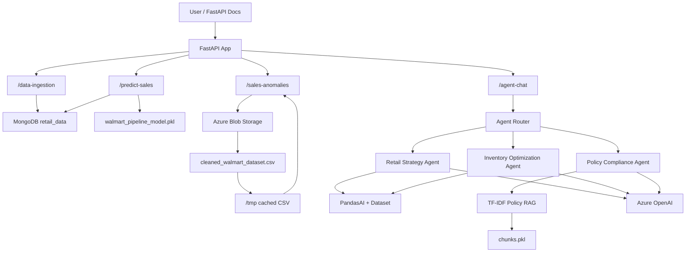
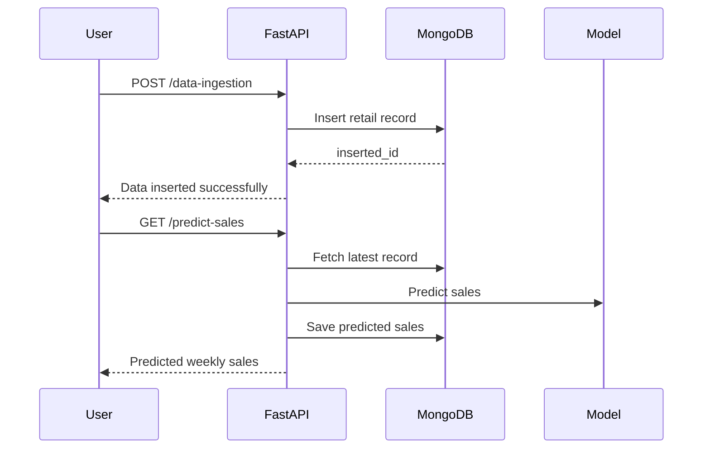
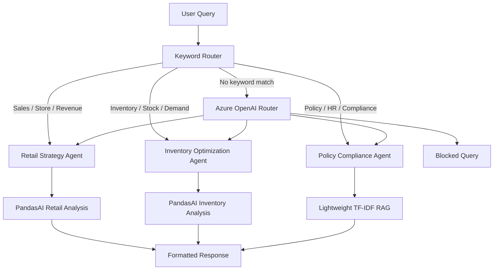
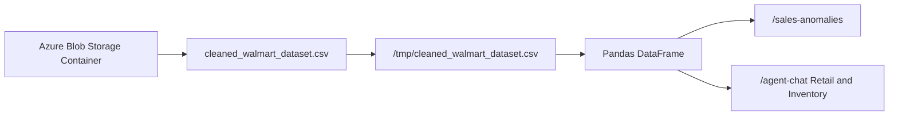
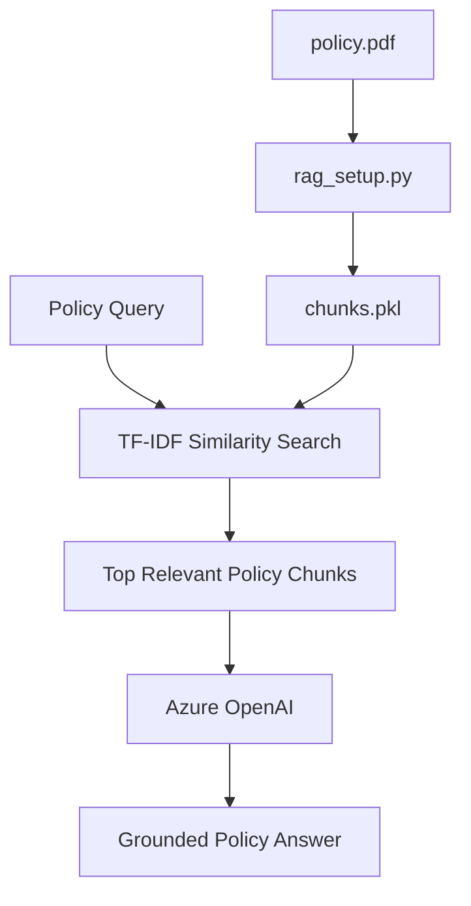
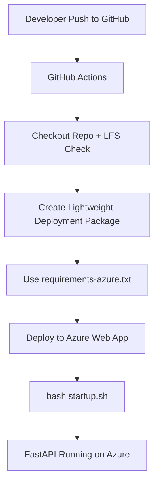

# Walmart AI Retail Assistant

This project is a FastAPI-based Walmart retail analytics assistant. It supports sales prediction, data ingestion, anomaly detection, and an agent-chat interface for retail, inventory, and policy-related questions.

## Main Features

- Data ingestion into MongoDB
- Sales prediction using a trained ML model
- Sales anomaly detection using the processed Walmart dataset from Azure Blob Storage
- Agent chat for:
  - Retail strategy queries
  - Inventory optimization queries
  - Policy compliance queries
- Azure Web App deployment using GitHub Actions CI/CD
- Lightweight policy RAG using TF-IDF retrieval over saved policy chunks

## High-Level Architecture



## API Flow



## Agent Chat Flow



## Dataset Flow

The large processed dataset is not stored in GitHub. It is stored in Azure Blob Storage and downloaded at runtime.



Required Azure App Settings:

```text
AZURE_STORAGE_CONNECTION_STRING
AZURE_CONTAINER_NAME
RETAIL_DATASET_BLOB=cleaned_walmart_dataset.csv
```

`RETAIL_DATASET_BLOB` is optional if the blob name is exactly:

```text
cleaned_walmart_dataset.csv
```

## Policy RAG Flow

The policy agent uses lightweight RAG. It does not use FAISS, Chroma, vector databases, or sentence-transformer embeddings in deployment.



Runtime file required:

```text
agents/rag_data/chunks.pkl
```

Helper file for regenerating chunks when the policy PDF changes:

```text
agents/rag_data/rag_setup.py
```

## Azure CI/CD Flow



## Important Azure Startup Command

Use this startup command in Azure Web App:

```bash
bash startup.sh
```

## Important Environment Variables

```text
MONGO_URL
AZURE_OPENAI_API_KEY
AZURE_OPENAI_API_VERSION
AZURE_OPENAI_ENDPOINT
AZURE_OPENAI_DEPLOYMENT
AZURE_STORAGE_CONNECTION_STRING
AZURE_CONTAINER_NAME
RETAIL_DATASET_BLOB
SCM_DO_BUILD_DURING_DEPLOYMENT=true
ENABLE_ORYX_BUILD=true
```

## Main Endpoints

```text
POST /data-ingestion
GET  /predict-sales
GET  /sales-anomalies
POST /agent-chat
GET  /all-predictions
GET  /docs
```

## Testing Order

1. Open `/docs`
2. Insert data using `/data-ingestion`
3. Run `/predict-sales`
4. Run `/sales-anomalies`
5. Run `/agent-chat`

## Notes

- The root path `/` may return `404 Not Found`; use `/docs` for FastAPI Swagger UI.
- The processed CSV is loaded from Azure Blob Storage and cached in `/tmp`.
- Policy RAG is TF-IDF based and uses `chunks.pkl`.
- The ML model file must be committed as a real pickle file, not a Git LFS pointer.
